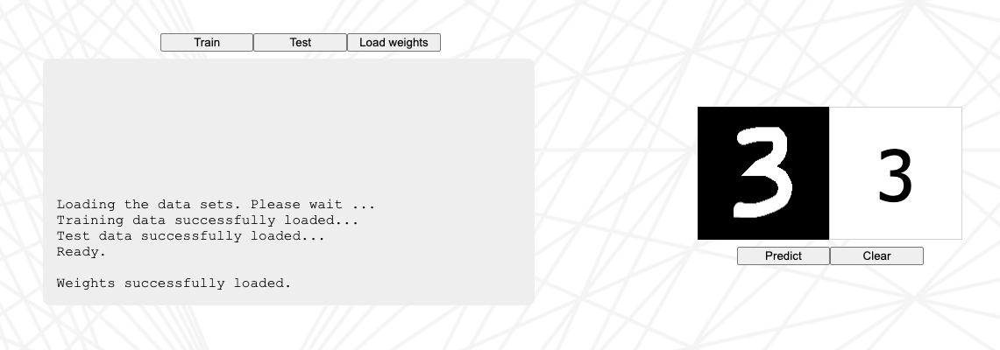

# neural-network-with-js

### Description

This is the project's repository for my We article "[Build Your Own Neural Network with JavaScript](https://lin-xiang.medium.com/make-your-own-neural-network-app-with-plain-javascript-and-a-tiny-bit-of-math-js-30ab5ff4cbd5)" on Medium.
In this article my goal is to show how to build a neural network with JavaScript from the scratch and embed it into a simple web app.

This web app can be used to train and test the neural network with the MNIST data set. Furthermore it allows the user to handwrite a digit and get a prediction from the network.

## Getting Started
### Installing
Due to their size, the MNIST data sets are not included in this repository. You will need the CSV versions. Please download them from [pjreddie](https://pjreddie.com/projects/mnist-in-csv/) and put them into the ./mnist folder.

### Starting
If you run the project locally it needs to be on a local webserver. Otherwise the file accesses won't work. Please leave a message if you run over any issues.

### Bonus
The file nn-with-stop.js is an advanced version of nn.js and includes a stop function to abort training/testing. If you want to use it, please embed it into index.html instead of nn.js.

